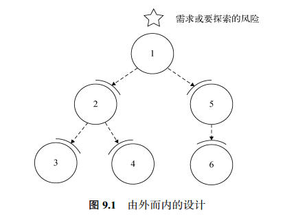

# tetris

俄罗斯方块演示程序，一个完整的俄罗斯游戏实现

演示了《软件设计：从专业到卓越》第9章，由外而内 所展示的演进式设计方法

# 软件设计：从专业到卓越 

<https://book.douban.com/subject/35966115/>

京东搜索：<https://search.jd.com/Search?keyword=%E8%BD%AF%E4%BB%B6%E8%AE%BE%E8%AE%A1%20%E4%BB%8E%E4%B8%93%E4%B8%9A%E5%88%B0%E5%8D%93%E8%B6%8A&enc=utf-8>

# 第9章 由外而内

设计和编码本是一体。由外而内的设计，也叫作意图导向的编程，
是把设计的思考过程、编码实现过程以及演进式设计完美结合在一起的方法。
熟练掌握由外而内的设计，可以大幅提升编码效率和质量。

## 9.1 如何由外而内

图9.1是一个关于由外而内设计策略的大致示意图。
其中圆形代表实际的编码实现，弧形代表在前一步导出的接口，
数字代表实现的顺序。

由外而内的设计包括如下几个步骤。

1. 选择一个系统功能，或者需要探索的问题。
2. 思考实现该功能或解决该问题，需要哪些更低层的模块，每个模块分别需要承担什么样的责任。
3. 用在第2步假设的模块和责任完成编码，当然此时这些模块和责任可能并不存在。
4. 逐个选择第3步中未实现的责任，把它作为一个新的待解决的问题，回到第1步

